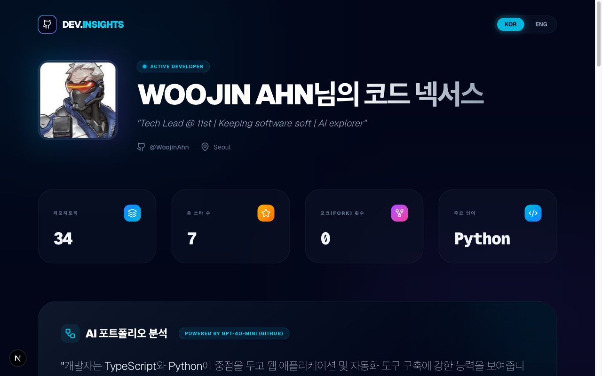

# Dev Insights Dashboard

<p align="center">
  <a href="https://woojinahn-dev.vercel.app">
    
  </a>
</p>

<p align="center">
  <b>English</b> | <a href="./README.ko.md"><b>한국어</b></a>
</p>

<p align="center">
  
</p>

AI-powered portfolio dashboard that visualizes [WoojinAhn](https://github.com/WoojinAhn)'s GitHub activity. Data is refreshed daily via GitHub Actions and analyzed by LLM (Gemini 2.0 Flash, with GPT-4o-mini fallback).

## Architecture

```
GitHub API ──→ refresh-data.sh ──→ public/data/*.json
                                        │
                                        ├──→ analyze-portfolio.py ──→ analysis.json
                                        │         (Gemini / GPT-4o-mini)
                                        │
                                        ├──→ detect-ai-tools.py ──→ ai-signals.json
                                        │         (GitHub API, rule-based)
                                        │
                                        └──→ Next.js client page (static JSON fetch)
```

**Three-phase pipeline:**

1. **Data collection** (`refresh-data.sh`): Fetches user profile, repos, pinned repos, and forks via `gh` CLI, writes JSON to `public/data/`.
2. **AI analysis** (`analyze-portfolio.py`): Sends repo data to Gemini 2.0 Flash (fallback: GitHub Models GPT-4o-mini), produces bilingual (en/ko) analysis with strengths, AI capabilities, and research interests.
3. **AI tool detection** (`detect-ai-tools.py`): Scans each repo for indicator files (`CLAUDE.md`, `.cursor/`, dependency files, etc.) via GitHub API — rule-based, no extra AI tokens.

The frontend is a Next.js App Router app: `app/page.tsx` is a server component that reads the JSON files via `fs` and passes data to a `'use client'` wrapper for language toggle and scroll state.

## Features

- **AI-generated portfolio analysis** with multi-LLM fallback (Gemini → GPT-4o-mini)
- **AI tool detection** — displays icons (Claude Code, Cursor, Gemini, Copilot, etc.) on project cards based on repo file indicators
- **Bilingual UI** (English / Korean toggle)
- **Research Radar** — visualizes technical interests from forked repos
- **Daily auto-refresh** via GitHub Actions + Vercel deploy hook

## Tech Stack

| Layer | Tech |
|-------|------|
| Frontend | Next.js 16 (App Router), React 19, Tailwind CSS 4, Lucide React, simple-icons |
| Data Pipeline | Python 3 (google-generativeai SDK), Bash (gh CLI) |
| AI | Gemini 2.0 Flash, GitHub Models GPT-4o-mini (fallback) |
| Deploy | Vercel, GitHub Actions |

## Getting Started

```bash
git clone https://github.com/WoojinAhn/dev-insights-dashboard.git
cd dev-insights-dashboard
npm install
npm run dev
```

To refresh data locally:

```bash
# Requires: gh CLI authenticated, GEMINI_API_KEY or GH_TOKEN env vars
./refresh-data.sh
```

## Built With

Initial scaffold by **Gemini CLI**, refined and maintained with **Claude Code**.
